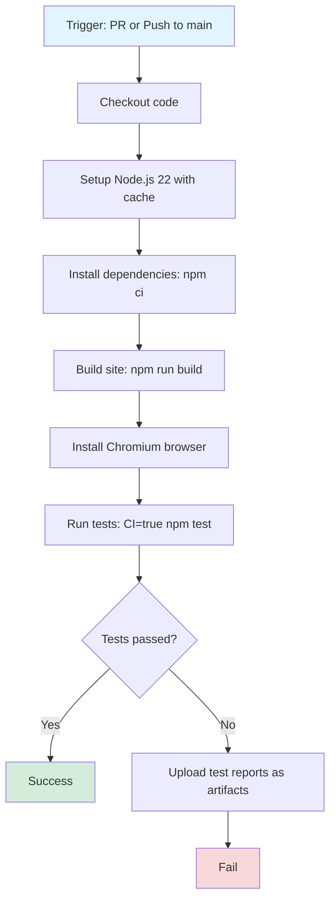

# Project Architecture

This document describes the project structure and infrastructure.

## Repository Structure

```mermaid
graph TD
    ROOT["."]
    ROOT --> DATA["_data/<br/>(Eleventy data files)"]
    ROOT --> INCLUDES["_includes/<br/>(Nunjucks templates/partials)"]
    ROOT --> ARTICLES["articles/<br/>(Blog articles in Markdown)"]
    ROOT --> ASSETS["assets/<br/>(Static assets)"]
    ROOT --> DOCS["docs/<br/>(AI agent documentation)"]
    ROOT --> INTEGRATION["integration/<br/>(Playwright test files)"]
    ROOT --> MISC["misc/<br/>(Miscellaneous files)"]
    ROOT --> PROJECTS["projects/<br/>(Project pages)"]
    ROOT --> PUBLIC["public/<br/>(Generated CSS and static files)"]
    ROOT --> STYLES["styles/<br/>(Source CSS files)"]
    ROOT --> ELEVENTY[".eleventy.js<br/>(Eleventy configuration)"]
    ROOT --> INDEX["index.njk<br/>(Homepage template)"]
    ROOT --> RESUME["resume.njk<br/>(Resume page template)"]
    ROOT --> SPEAKING["speaking.njk<br/>(Speaking engagements)"]
    ROOT --> SITEMAP["sitemap.njk<br/>(Sitemap template)"]
    ROOT --> RSS["rss.njk<br/>(RSS feed template)"]
    
    style PUBLIC fill:#fff3cd
    style DOCS fill:#d1ecf1
    style INTEGRATION fill:#d1ecf1
```

**Key directories:**
- **Source content**: `articles/`, `projects/`, `_includes/`
- **Generated files**: `public/` (do not modify directly)
- **Configuration**: `.eleventy.js`, `tailwind.config.js`, `playwright.config.js`
- **Documentation**: `docs/` (AI agent guides)

## Key Configuration Files

| File | Purpose |
|------|---------|
| `.eleventy.js` | Eleventy configuration, plugins, filters, collections |
| `tailwind.config.js` | Tailwind CSS configuration |
| `playwright.config.js` | Playwright test configuration |
| `.editorconfig` | Editor settings (2 space indent, LF line endings) |
| `package.json` | Dependencies and npm scripts |
| `.env.development` | Development environment variables |
| `.env.production` | Production environment variables |

## Technology Stack

- **Static Site Generator**: Eleventy (11ty) v3.1.2
- **Template Engine**: Nunjucks
- **Styling**: Tailwind CSS v3.4.19
- **Testing**: Playwright
- **Build Tool**: npm scripts with npm-run-all
- **Node Version**: 22.17.0 (managed via Volta)
- **Code Formatting**: Prettier (via @jabraf/prettier config)
- **Git Hooks**: Husky with pretty-quick for pre-commit formatting

## CI/CD Pipeline

**GitHub Actions** workflow (`.github/workflows/ci.yml`):

**Triggers:**
- Pull requests (opened, synchronized, reopened)
- Pushes to `main` branch

**Concurrency:** Cancels in-progress runs for the same ref to save resources.

> **Note for AI Agents:** When documenting workflows or processes in this project, prefer Mermaid diagrams for visual clarity. Use `flowchart` for processes, `graph` for relationships, and `sequenceDiagram` for interactions. This improves comprehension and maintains consistency across documentation.

## Version Tracking

Version is tracked via git commit hash stored in `version.txt`:
- Generated during build process
- Accessible in templates via `appVersion` filter
- First 7 characters of commit SHA

## Generated Files

**Do not modify these directly:**
- `public/*.css` - Generated from `styles/*.css` by Tailwind
- `_site/` - Eleventy build output (if present)
- `version.txt` - Generated during build
- `node_modules/` - Dependencies

These files are either build artifacts or should be managed through their source files.
