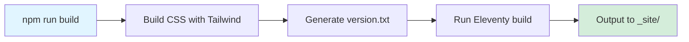

# Development Workflows

This document covers the standard development workflows for this project.

## Starting Development

```bash
npm start
```

This command runs both:

- Eleventy dev server with live reload (port 8080)
- Tailwind CSS watch mode for style changes

Access the site at: `http://localhost:8080`

## Building for Production

```bash
npm run build
```



**Build process:**

1. Builds CSS with Tailwind (minified)
2. Generates `version.txt` with git commit hash
3. Runs Eleventy build

Output is in `_site/` directory (default Eleventy output).

## Testing

```bash
npm test               # Run Playwright tests (headless)
npm run test:headed    # Run with browser visible
npm run test:ui        # Open Playwright UI mode
npm run test:report    # View test report
```

See [TESTING.md](../TESTING.md) for comprehensive testing guidelines.

## Code Formatting

Code is automatically formatted on commit via Husky pre-commit hook.

**Manual formatting:**

```bash
npx prettier --write <file>
```

Prettier configuration is from `@jabraf/prettier` package (referenced in `package.json`).

## Preview Production Build

```bash
npm run preview
```

Builds the site and serves it on port 8080 with production settings.
